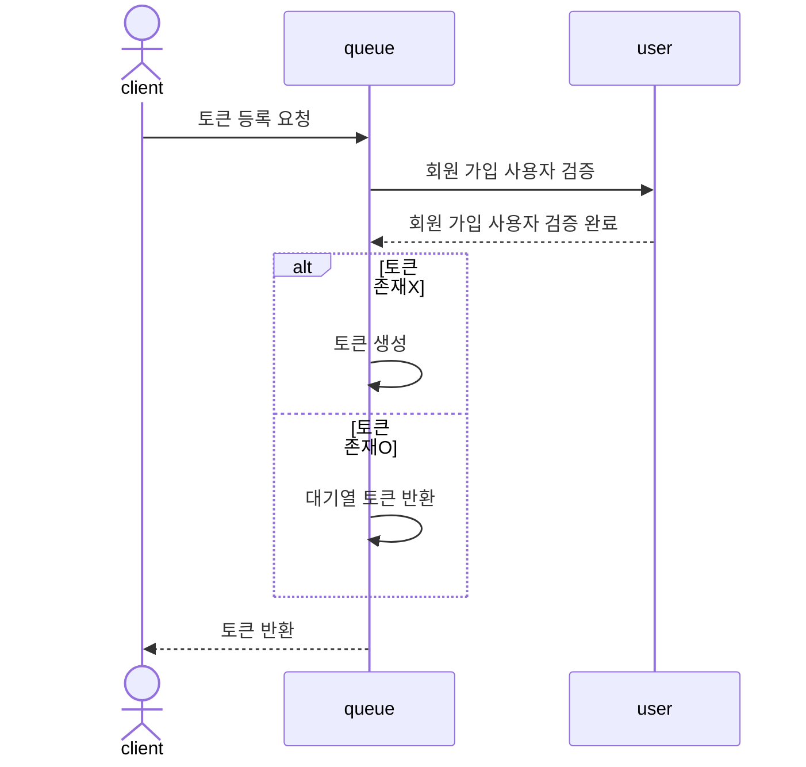
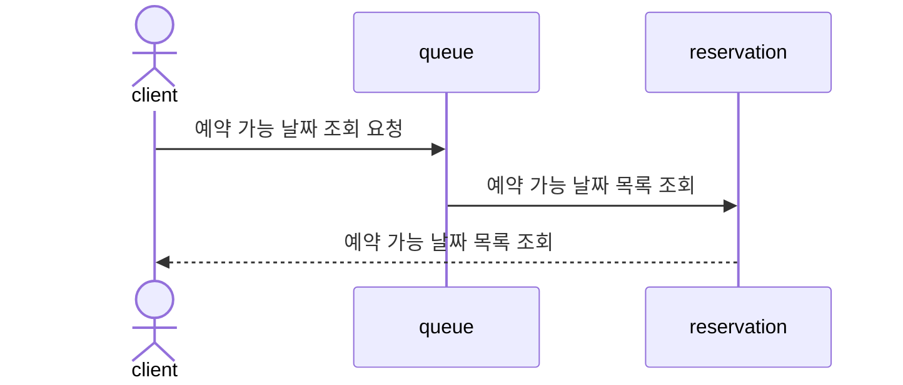
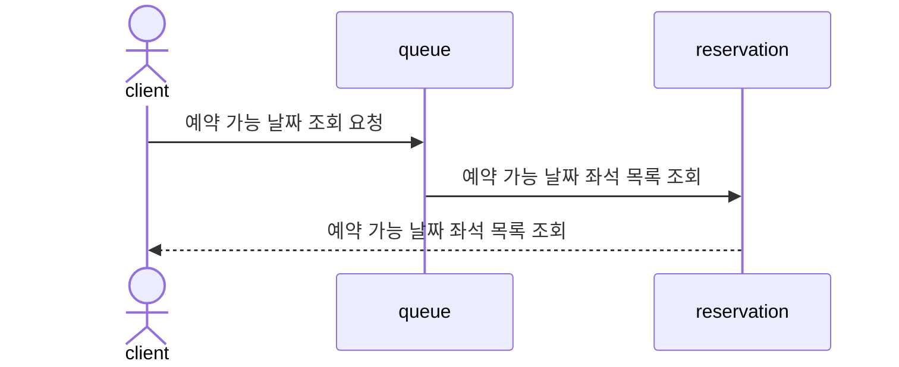
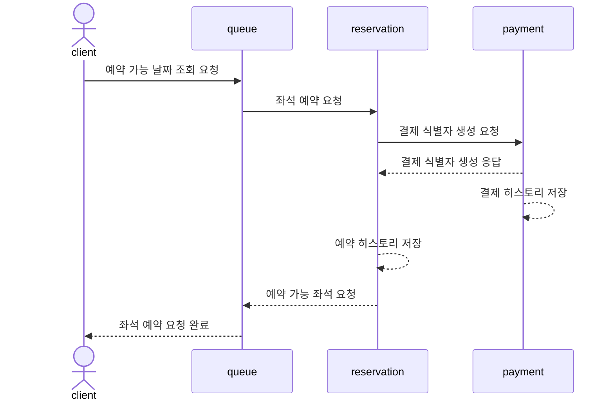
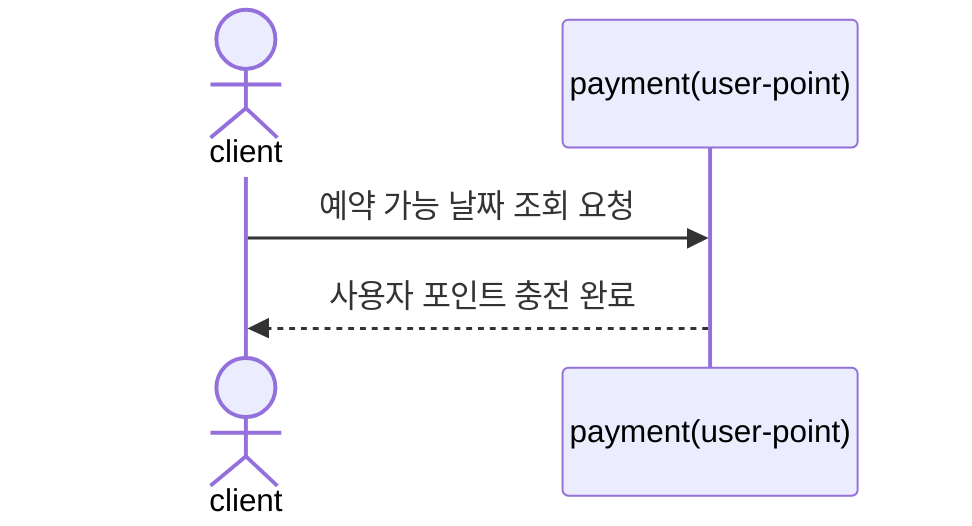
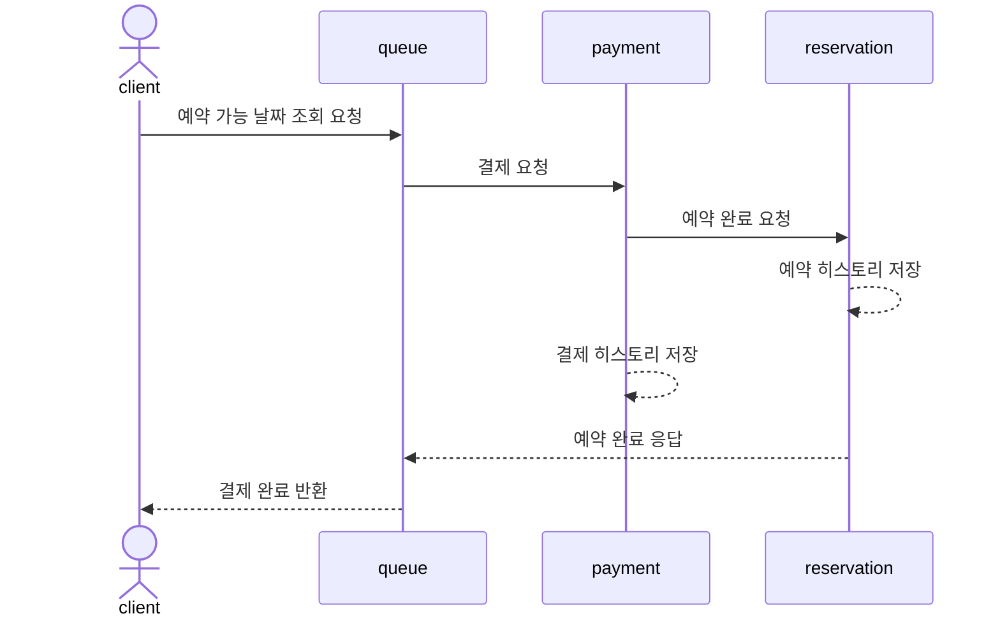

# Concert documentation

## [1. Business Flow](https://github.com/pbg0205/concert/issues/2)

 

## [2. Milestone](https://docs.google.com/spreadsheets/d/1F1CJ5Mjd31iMWgo82KW-EIPwzsjAE8RtcF9B1CvQzLc/edit?gid=1991800281#gid=1991800281)

 

## 3. API 명세
1. [유저 대기열 토큰 발급 API](https://github.com/pbg0205/concert/issues/1)
2. [예약 가능 날짜 조회 API](https://github.com/pbg0205/concert/issues/5)
3. [예약 가능 날짜 좌석 조회 API](https://github.com/pbg0205/concert/issues/6)
4. [좌석 예약 API](https://github.com/pbg0205/concert/issues/7)
5. 사용자 포인트 충전/조회
    1. [사용자 포인트 충전 API](https://github.com/pbg0205/concert/issues/8)
    2. [사용자 포인트 조회 API](https://github.com/pbg0205/concert/issues/10)
6. [결제 요청 API](https://github.com/pbg0205/concert/issues/9)

 

## [4. State-Transition Diagram](https://github.com/pbg0205/concert/issues/3)
### (1) 예약 상태 다이어그램

### (2) 결제 상태 다이어그램

 

## [5. Sequence Diagram](https://github.com/pbg0205/concert/issues/4)

### 1. 유저 토큰 발급

### 2. 예약 가능 날짜 조회

### 3. 예약 가능 날짜 좌석 조회

### 4. 좌석 예약 요청

### 5. 사용자 포인트 충전

### 6. 결제 요청

