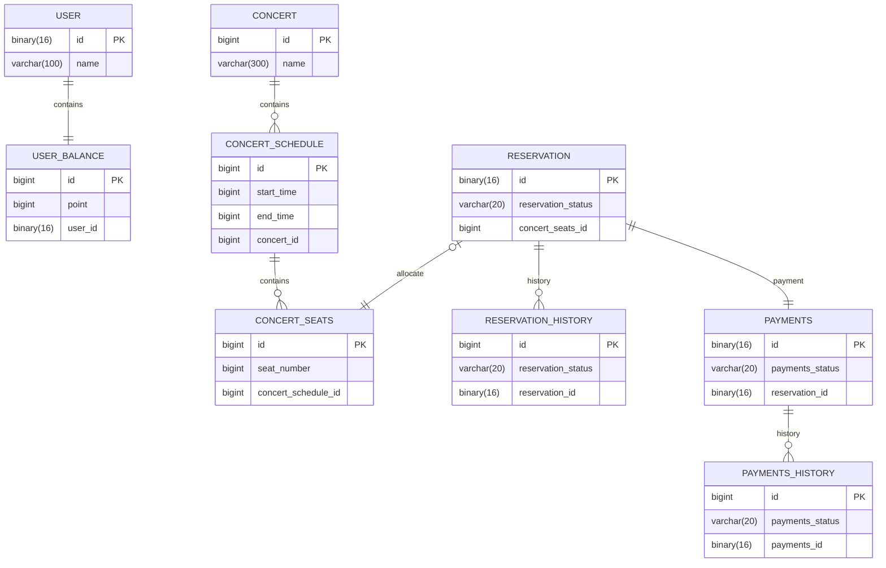

# concert

## 6. ERD

### (1) 논리 ERD

### (2) 물리 ERD

```mermaid
erDiagram
    USER ||--|| USER_BALANCE : contains
    CONCERT ||--o{ CONCERT_SCHEDULE: contains
    CONCERT_SCHEDULE ||--o{ CONCERT_SEATS: contains
    RESERVATION|o--||CONCERT_SEATS: allocate
    RESERVATION||--o{RESERVATION_HISTORY: history
    RESERVATION||--||PAYMENTS: payment
    PAYMENTS||--o{ PAYMENTS_HISTORY: history
    
    USER {
        binary(16) id PK
        varchar(100) name
    }

   USER_BALANCE {
      bigint id PK
      bigint point
      binary(16) user_id
   }
    
    CONCERT {
        bigint id PK
        varchar(300) name
    }
    
    CONCERT_SCHEDULE {
        bigint id PK
        bigint start_time
        bigint end_time
        bigint concert_id
    }
    
    CONCERT_SEATS {
        bigint id PK
        bigint seat_number
        bigint concert_schedule_id
    }
    
    RESERVATION {
        binary(16) id PK
        varchar(20) reservation_status
        bigint concert_seats_id
    }
    
    RESERVATION_HISTORY {
        bigint id PK
        varchar(20) reservation_status
        binary(16) reservation_id
    }
    
    PAYMENTS {
        binary(16) id PK
        varchar(20) payments_status
        binary(16) reservation_id
    }

    PAYMENTS_HISTORY {
        bigint id PK
        varchar(20) payments_status
        binary(16) payments_id
    }
```

